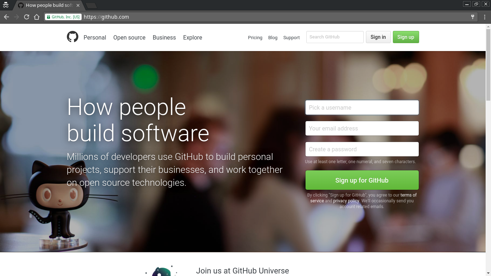

# Introduction to Git Version Management

Since we are hosting the OER on GitHub, we start with a discussion of Git itself.

## GitHub, a Center of Git Activity

[GitHub][github] is one of the premier sites for hosting git repositories. Aside from free public repository hosting, GitHub provides free collaborative features such as issue trackers, wiki pages, and advanced branch merging options.

[github]: https://github.com/

### Creating a GitHub Account

To create a GitHub account, enter your email address and choose a username and password at the [GitHub Sign-Up page][github-join]. After email address confirmation you can log in and create your first repository.

[github-join]:https://github.com/join

### Collaboration on Existing GitHub Projects

As an example, let's use this course.

### Continuous Publishing to Other Formats

Not everyone reader of your document will want to read the source documents. Instead, we hope to publish the documents in a variety of formats for a variety of devices. In this document we focus on publishing to pdf, to epub, and to html. We want the documents to be automatically available in all those formats as soon as the source documents are modified.
